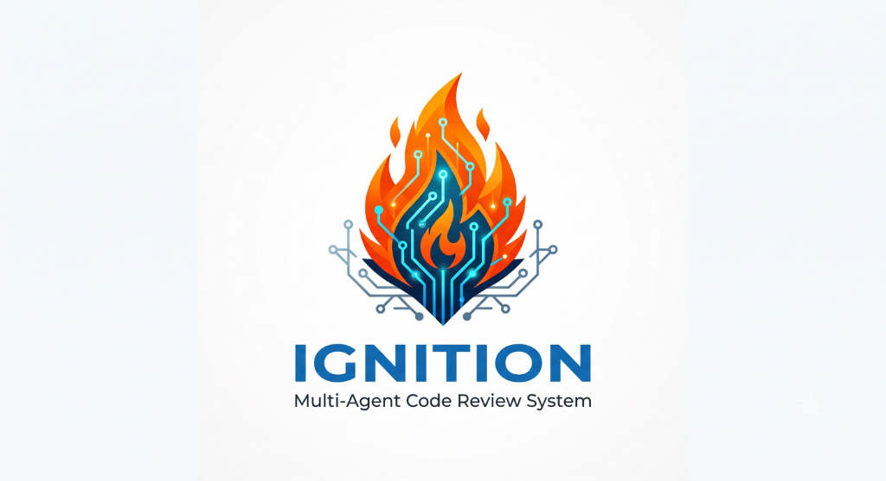

<p align="center">
  
</p>

<h1 align="center">🔥 Ignition</h1>
<p align="center"><b>Your PRs just got faster than your reviewers. This is how you catch up.</b></p>

<p align="center">
  
  
  
  
  
</p>

---

## The bottleneck nobody's talking about

AI can write a pull request in ninety seconds. Your senior engineer still needs twenty minutes to review it — and now there are five times as many PRs landing in the queue.

Review didn't get faster when code generation did. It just got busier. And the tools that promise to fix this by "pointing an LLM at your diff" tend to fall apart in the same predictable ways: one model juggling architecture, logic, and security at once defaults to skimming for the happy path. It confidently flags a bug that doesn't exist. It misses the one-line field rename that quietly breaks three downstream services. It has no idea whether that new npm package you just added is legitimate or was published four hours ago by someone hoping nobody would check.

**Ignition is what happens when you stop asking one model to do everything, and build a team instead.**

## Meet the review team

Ignition doesn't review your PR — it convenes a panel. Four specialized agents, each with exactly one job, working in parallel and reporting to a critic who trusts no one's work until it's been checked against the actual code.

```
Incoming PR
     │
     ▼
🚦 Deterministic gate — the obvious stuff gets caught instantly, no AI required
     │
     ▼
 ┌──────────────┬───────────────┬────────────────┐
 │ 🏛️ Architecture│ 🌀 Logic &     │ 🔒 Security &   │   three specialists,
 │   Inspector    │   Chaos Agent │   Supply Chain  │   working at once,
 │                │                │   Auditor       │   never stepping on
 └──────────────┴───────────────┴────────────────┘   each other's turf
     │
     ▼
🧠 The Critic
   — fact-checks every single finding against your real codebase
   — scores the PR's overall health and flags anything sliding backward
   — decides — deterministically, no vibes — whether a human needs to see this
     │
     ▼
📝 A clean, structured review comment, waiting on your PR
```

No finding reaches you unverified. No decision to escalate is a guess. And if something looks fishy, the system is allowed to double-check itself — but only so many times, because an AI stuck in a loop with your API budget is nobody's idea of a good time.

## What makes this different (and why it matters)

**It doesn't panic and generalize.** Each agent owns one lane — architecture, logic/performance, or security — and stays in it. No context dilution, no superficial "looks fine to me" pass.

**It doesn't just trust itself.** Every finding gets fact-checked against your actual code before it's shown to you. If the AI can't prove it, you never see it.

**It doesn't cost more the longer it's unsure.** Retries are capped. If verification stalls, the system flags it for a human instead of burning through your API budget trying to convince itself.

**It doesn't decide "this is bad" on a whim.** Escalation to a human is driven by a fixed, structured severity level — not a confidence score that might mean something different every time. Same category of problem, same response, every single time.

**It checks cheap things first.** Rule-based checks run before any model is invoked at all — obvious violations get rejected in milliseconds, for free.

## Under the hood

| Layer | Choice |
|---|---|
| Agent orchestration | [LangGraph](https://github.com/langchain-ai/langgraph) (Python) |
| API / webhook layer | FastAPI, streaming live progress over SSE |
| Static analysis engine | Bun + [ts-morph](https://github.com/dsherret/ts-morph), running as a persistent service |
| Data & vector storage | Supabase (Postgres) + pgvector |
| GitHub integration | PyGithub |
| Frontend / dashboard | Next.js, Tailwind, shadcn/ui |

## What v1 deliberately doesn't do

- **No autopilot merges.** Anything critical stops and waits for a human. Always.
- **TypeScript/JavaScript only, for now.** Depth over breadth, first.
- **No IDE plugin.** This lives on your webhook, not your keystrokes — that's a different product for a different day.

## Where this stands today

This is a solo build, and it's mid-flight. The agent graph, the deterministic gates, and the static analysis pipeline are real and running. The reasoning layer for each specialist agent is being tuned as I go. If you're reading this while it's still rough around the edges — that's the honest state of an actively-built system, not a stalled one.

## Try it yourself

```bash
git clone https://github.com/suchitchopade3110-arch/Ignition.git
cd Ignition

# Python backend
pip install -r requirements.txt
cp .env.example .env   # bring your own credentials — never commit this file

# AST analysis service
cd ast-analyzer
bun install
```

You'll need your own GitHub App, a Supabase project, and an LLM API key to actually run this end-to-end. None of that is required just to read the code.

```bash
# Terminal 1 — the static analysis service
cd ast-analyzer && bun run server.ts

# Terminal 2 — the API
uvicorn app.main:app --reload
```

## How it's organized

```
ignition_backend/
├── app/
│   ├── main.py            # FastAPI entrypoint, webhook handling, SSE streaming
│   ├── graph/              # The LangGraph state machine: nodes, routing, scoring
│   ├── rag/                # Semantic retrieval for historical context
│   ├── repositories/       # Data access layer
│   ├── schemas/            # Pydantic contracts (GitHub payloads, AST payloads)
│   └── services/           # External integrations (GitHub, AST service, LLM)
├── ast-analyzer/           # Persistent Bun/ts-morph static analysis service
└── tests/                  # Unit tests for the deterministic control-flow logic
```

The interesting parts — how each agent reasons, what triggers escalation, how verification actually catches a hallucination — live in the code, not in this README. If that's what you're here for, go read `app/graph/`.

## License

MIT — see [LICENSE](./LICENSE).

## Built by

[Suchit Chopade](https://github.com/suchitchopade3110-arch) — as a hands-on exploration of what it actually takes to make multi-agent AI systems *trustworthy*, not just impressive: deterministic control flow, real parallel orchestration, and verification that doesn't just take the model's word for it.
