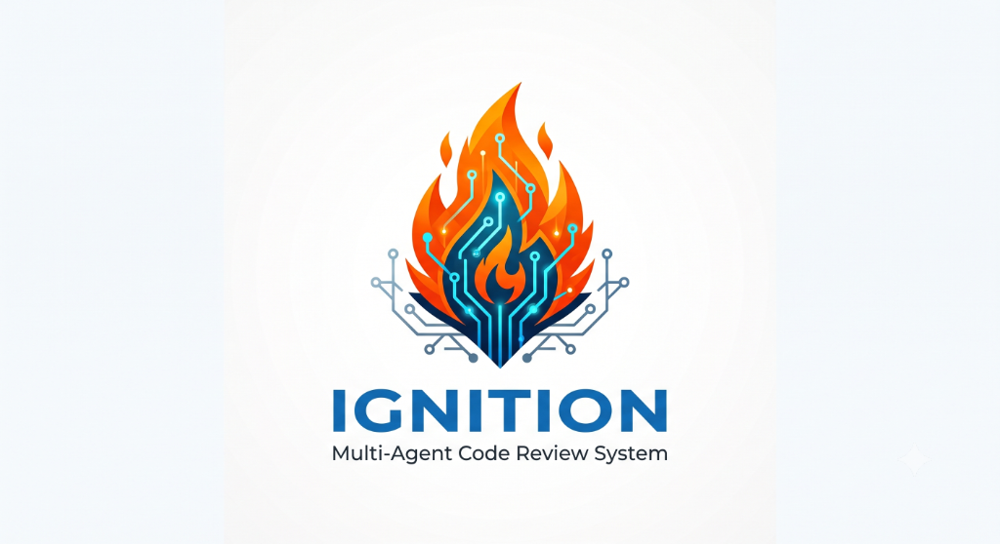

<p align="center">
  
</p>

<h1 align="center">🔥 Ignition</h1>
<p align="center"><b>Your PRs just got faster than your reviewers. This is how you catch up.</b></p>

<p align="center">
  
  
  
  
  
</p>

---

## The bottleneck nobody's talking about

AI can write a pull request in ninety seconds. Your senior engineer still needs twenty minutes to review it — and now there are five times as many PRs landing in the queue.

Review didn't get faster when code generation did. It just got busier. And the tools that promise to fix this by "pointing an LLM at your diff" tend to fall apart in the same predictable ways: one model juggling architecture, logic, and security at once defaults to skimming for the happy path. It confidently flags a bug that doesn't exist. It misses the one-line field rename that quietly breaks three downstream services. It has no idea whether that new npm package you just added is legitimate or was published four hours ago by someone hoping nobody would check.

**Ignition is what happens when you stop asking one model to do everything, and build a team instead.**

## Meet the review team

Ignition doesn't review your PR — it convenes a panel. Four specialized agents, each with exactly one job, working in parallel and reporting to a critic who trusts no one's work until it's been checked against the actual code.

```
Incoming PR
     │
     ▼
🚦 Deterministic gate — the obvious stuff gets caught instantly, no AI required
     │
     ▼
 ┌──────────────┬───────────────┬────────────────┐
 │ 🏛️ Architecture│ 🌀 Logic &     │ 🔒 Security &   │   three specialists,
 │   Inspector    │   Chaos Agent │   Supply Chain  │   working at once,
 │                │                │   Auditor       │   never stepping on
 └──────────────┴───────────────┴────────────────┘   each other's turf
     │
     ▼
🧠 The Critic
   — fact-checks every single finding against your real codebase
   — scores the PR's overall health and flags anything sliding backward
   — decides — deterministically, no vibes — whether a human needs to see this
     │
     ▼
🩹 Auto-Fix Patch Generator — posts inline `suggestion` comments for the
   findings that came with a proposed patch (never applied automatically;
   you click "Apply suggestion" like any other GitHub review suggestion)
     │
     ▼
📝 A clean, structured review comment, waiting on your PR
```

No finding reaches you unverified. No decision to escalate is a guess. And if something looks fishy, the system is allowed to double-check itself — but only so many times, because an AI stuck in a loop with your API budget is nobody's idea of a good time.

The Auto-Fix step only runs on the path that finalizes a review — it's skipped entirely when the Critic pauses for human approval or when Agent 1's deterministic gate rejects the PR outright. When two findings from different agents both propose a patch touching the same file and line, it doesn't post both (that would produce a broken diff): it deterministically keeps the higher-severity one and drops the rest, logging what got dropped.

## What makes this different (and why it matters)

**It doesn't panic and generalize.** Each agent owns one lane — architecture, logic/performance, or security — and stays in it. No context dilution, no superficial "looks fine to me" pass.

**It doesn't just trust itself.** Every finding gets fact-checked against your actual code before it's shown to you. If the AI can't prove it, you never see it.

**It doesn't cost more the longer it's unsure.** Retries are capped. If verification stalls, the system flags it for a human instead of burning through your API budget trying to convince itself.

**It doesn't decide "this is bad" on a whim.** Escalation to a human is driven by a fixed, structured severity level — not a confidence score that might mean something different every time. Same category of problem, same response, every single time.

**It checks cheap things first.** Rule-based checks run before any model is invoked at all — obvious violations get rejected in milliseconds, for free.

## Under the hood

| Layer | Choice |
|---|---|
| Agent orchestration | [LangGraph](https://github.com/langchain-ai/langgraph) (Python) |
| API / webhook layer | FastAPI, streaming live progress over SSE |
| Static analysis engine | Bun + [ts-morph](https://github.com/dsherret/ts-morph), running as a persistent service |
| Data & vector storage | Supabase (Postgres) + pgvector |
| GitHub integration | PyGithub |
| Rate limiting | [slowapi](https://github.com/laurentS/slowapi) on the webhook, OAuth login, and every `/api/*` route |
| Metrics | Prometheus (`prometheus_client`) at `GET /metrics` — HTTP, webhook, review-lifecycle, and HITL counters |
| Frontend / dashboard | Next.js, Tailwind, shadcn/ui |

## Testing & CI

Every layer has its own test suite, and CI (`.github/workflows/ci.yml`) runs all of them on every PR and push to `main`:

| Suite | Command | Covers |
|---|---|---|
| Backend | `pytest tests/` | The deterministic gate, routing, scoring, auth, CSRF, webhook handling, HITL, reconciliation, metrics — the control-flow logic, all with GitHub/Supabase/Redis/the LLM mocked |
| Frontend | `cd frontend && npm test` (vitest) | Query-key/cache/retry-policy logic and the dashboard's components — severity/status badges, stats cards, finding cards, the HITL approve/reject flow |
| AST analyzer | `cd ast-analyzer && bun test` | Symbol extraction, dependency-graph resolution, the hard-rule violation detector (including its documented false-positive cases), package-diffing, and the project-cache LRU eviction |

`lint`/`typecheck` run alongside the frontend suite, and a `docker-build` job builds both Dockerfiles (backend+worker, AST analyzer) on every run — build-only, since nothing here has registry push credentials.

Dependency scanning runs as its own CI job: `pip-audit` against `requirements.txt` is blocking (the backend tree is currently clean), while `npm audit`/`bun audit` are informational for now — both trees carry pre-existing high-severity transitive advisories that need triage before they can gate merges. [Dependabot](./.github/dependabot.yml) opens weekly update PRs across pip, npm, bun, both Dockerfiles, and the GitHub Actions themselves.

## Deploying to production

Want to deploy on Render specifically? `render.yaml` at the repo root is a
ready-to-sync Blueprint, and `docs/DEPLOY_RENDER.md` walks through the whole
first deploy — provisioning the GitHub App/OAuth App/Supabase project,
filling in secrets, and the cross-origin cookie gotcha two separate
`*.onrender.com` services run into. The rest of this section applies to any
target.

Set `APP_ENV=production` — at startup this auto-corrects/flags a few
defaults that are safe for local dev but not for a real deployment
(forces `SESSION_COOKIE_SECURE=true`, warns if `ALLOWED_ORIGINS` is still
the localhost default or `GITHUB_WEBHOOK_SECRET` is unset). If the frontend
and backend are deployed as separate sites (no shared registrable domain —
e.g. two different `*.onrender.com` subdomains), also set
`SESSION_COOKIE_SAMESITE=none`, or the browser never attaches the session
cookie to the frontend's cross-origin requests and login silently loops. See
`Settings.validate_production_safety` in `app/config.py` and the comments
in `.env.example` for the full list of what's checked and the new
rate-limit / cache-size knobs (`RATE_LIMIT_STORAGE_URI`,
`WEBHOOK_RATE_LIMIT`, `AUTH_RATE_LIMIT`, `AST_CACHE_MAX_PROJECTS`).

`GET /healthz` checks real reachability of every dependency the app
actually needs to function — Supabase, the AST analyzer, the LLM
provider, and Redis (the Arq queue + SSE backbone) — not just "is the
process up."

`GET /metrics` is a Prometheus scrape target (unauthenticated, like
`/healthz`) — HTTP request count/latency by route, webhook delivery
outcomes, review completion counts/duration by status, and HITL
resolution counts. Set `METRICS_ENABLED=false` to omit the endpoint.

Cookie-authenticated, state-changing `/api/*` routes (HITL approve/reject,
repo settings) are protected by a CSRF double-submit cookie in addition to
the session cookie's own `SameSite=Lax` — see
`app/security.py::verify_csrf_token`. The frontend api-client handles this
automatically; a non-browser client needs to echo the `ignition_csrf_token`
cookie back as an `X-CSRF-Token` header on those requests.

`GITHUB_WEBHOOK_SECRET` supports zero-downtime rotation via
`GITHUB_WEBHOOK_SECRET_PREVIOUS` — see `docs/SECRET_ROTATION.md`.

## What v1 deliberately doesn't do

- **No autopilot merges.** Anything critical stops and waits for a human. Always. The Auto-Fix step (see above) only ever posts a suggested patch as a review comment for you to accept or ignore — it never commits, pushes, or merges anything itself.
- **TypeScript/JavaScript only, for now.** Depth over breadth, first.
- **No IDE plugin.** This lives on your webhook, not your keystrokes — that's a different product for a different day.

## Where this stands today

This is a solo build, and it's mid-flight. The agent graph, the deterministic gates, and the static analysis pipeline are real and running. The reasoning layer for each specialist agent is being tuned as I go. If you're reading this while it's still rough around the edges — that's the honest state of an actively-built system, not a stalled one.

## Try it yourself

```bash
git clone https://github.com/suchitchopade3110-arch/Ignition.git
cd Ignition

# Python backend
pip install -r requirements.txt
cp .env.example .env   # bring your own credentials — never commit this file

# AST analysis service
cd ast-analyzer
bun install
```

You'll need your own GitHub App, a Supabase project, and an LLM API key to actually run this end-to-end. None of that is required just to read the code.

`requirements.txt` is fully pinned with hashes, compiled from `requirements.in` (the loosely-versioned direct dependencies) — `pip install -r requirements.txt` reproduces the exact same dependency tree every time, not whatever happens to resolve on the day you install. To regenerate it after changing `requirements.in`:

```bash
pip install uv
uv pip compile --generate-hashes --output-file=requirements.txt requirements.in
```

```bash
# Terminal 1 — the static analysis service
cd ast-analyzer && bun run server.ts

# Terminal 2 — the API
uvicorn app.main:app --reload
```

## How it's organized

```
Ignition/
├── app/
│   ├── main.py            # FastAPI entrypoint, webhook handling, SSE streaming
│   ├── graph/              # The LangGraph state machine: nodes, routing, scoring
│   ├── rag/                # Semantic retrieval for historical context
│   ├── repositories/       # Data access layer
│   ├── schemas/            # Pydantic contracts (GitHub payloads, AST payloads)
│   └── services/           # External integrations (GitHub, AST service, LLM)
├── tests/                  # Backend unit/integration tests (pytest)
├── ast-analyzer/           # Persistent Bun/ts-morph static analysis service
│   ├── analyzer.ts         # Symbol extraction, dependency graph, hard-rule detection
│   ├── server.ts           # Elysia HTTP service wrapping the analyzer
│   └── *.test.ts           # bun test — parsing logic + project-cache eviction
└── frontend/               # Next.js dashboard (App Router, Tailwind, shadcn/ui)
    ├── src/app/             # Routed pages: dashboard, reviews, HITL, ledger, repos
    ├── src/components/      # Reusable UI (badges, cards, layout, auth guard)
    └── tests/               # vitest — hooks/query-cache logic + components
```

The interesting parts — how each agent reasons, what triggers escalation, how verification actually catches a hallucination — live in the code, not in this README. If that's what you're here for, go read `app/graph/`.

## License

MIT — see [LICENSE](./LICENSE).

## Built by

[Suchit Chopade](https://github.com/suchitchopade3110-arch) — as a hands-on exploration of what it actually takes to make multi-agent AI systems *trustworthy*, not just impressive: deterministic control flow, real parallel orchestration, and verification that doesn't just take the model's word for it.
